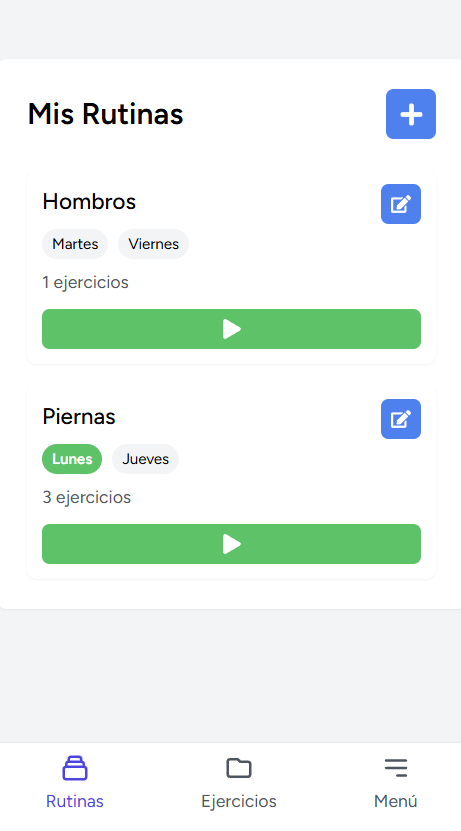
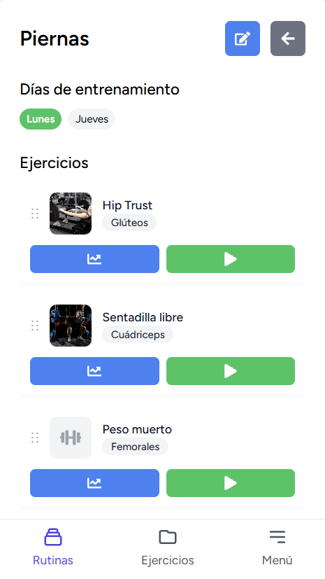
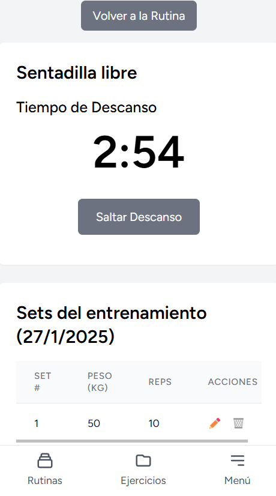
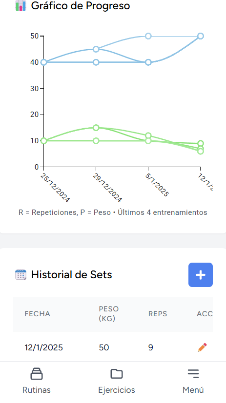
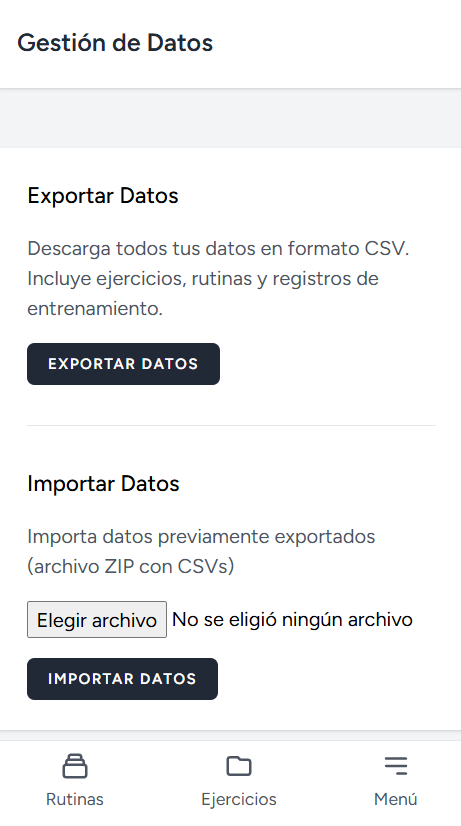

# 💪 GymProgress - Seguimiento de Entrenamiento

Una aplicación web moderna para el seguimiento y registro de rutinas de entrenamiento en el gimnasio, diseñada para ayudarte a mantener un registro detallado de tu progreso y rutinas de ejercicios.

|  |  |
|:----------------------------:|:----------------------------:|
|  |  |
|  |  |

## 🌟 Características

- **Gestión de Ejercicios**
  - Biblioteca de ejercicios organizados por grupo muscular
  - Detalles específicos para cada ejercicio (músculo objetivo)
  - Capacidad para añadir nuevos ejercicios personalizados

- **Rutinas Personalizadas**
  - Creación y gestión de rutinas por día de la semana
  - Organización de ejercicios por grupos musculares (Piernas, Hombros, etc.)
  - Programación flexible de días de entrenamiento

- **Seguimiento de Series**
  - Registro detallado de peso, repeticiones y series
  - Temporizador de descanso integrado
  - Historial completo de cada ejercicio

- **Análisis de Progreso**
  - Gráficos visuales de progreso en peso y repeticiones
  - Historial detallado de entrenamientos anteriores


## 📱 Interfaz de Usuario

La aplicación cuenta con una interfaz intuitiva y fácil de usar que incluye:

- Navegación principal entre Rutinas y Ejercicios
- Buscador de ejercicios
- Visualización clara de series y progreso
- Botones de acción rápida para registro y edición


## 📦 Instalación

### Requisitos Previos

- Docker
- Docker Compose

### Pasos de Instalación

1. Clona el repositorio:

    ```bash
    git clone https://github.com/Leo-Spj/gymprogress.git
    cd gymprogress
    ```

2. Copia el archivo de entorno de ejemplo y configura las variables necesarias:

    ```bash
    cp .env.example .env
    ```

3. Genera la clave de la aplicación:

    ```bash
    docker-compose run --rm app php artisan key:generate
    ```

4. Levanta los contenedores de Docker:

    ```bash
    docker-compose up -d
    ```

5. Ejecuta las migraciones de la base de datos:

    ```bash
    docker-compose exec app php artisan migrate
    ```

6. Instala las dependencias de npm y construye los assets:

    ```bash
    docker-compose exec app npm install
    docker-compose exec app npm run build
    ```

7. Crea el enlace simbólico para el almacenamiento:

    ```bash
    docker-compose exec app php artisan storage:link
    ```

Tu aplicación debería estar corriendo en [http://localhost:8000](http://localhost:8000).


## 📈 Planes Futuros

- Implementación de estadísticas avanzadas
- Compartir rutinas entre usuarios
- Versión móvil nativa
- Integración con wearables ?

